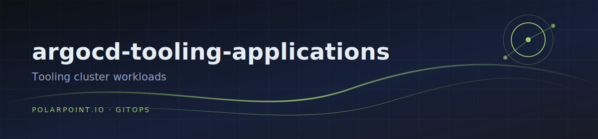

# argocd-tooling-applications

Workloads for the **tooling** cluster, deployed remotely by the hub
ArgoCD (controller cluster) via the `tooling-applications` parent.

## Layout

```
releases/                  Helm chart rendered by the parent Application
  values.yaml              parent: true variant
  global-values-<env>.yaml children variant (project, destination = tooling cluster)
  templates/               parent/children application templates
  apps/<category>/<app>/   one descriptor per app per env: <env>.yaml
```

## Current apps

| Category | App | Source |
|----------|-----|--------|
| platform | toolhive-operator-crds | oci://ghcr.io/stacklok/toolhive |
| platform | toolhive-operator | oci://ghcr.io/stacklok/toolhive |
